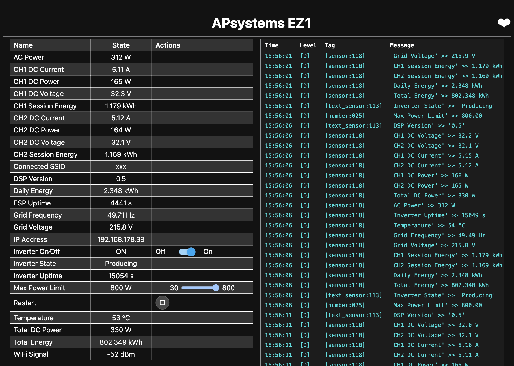

# open-apsystems

Reverse-engineering the **APsystems EZ1-M microinverter**.

Replaces the factory ESP32-C2 firmware with [ESPHome](https://esphome.io), giving you direct Home Assistant integration — no cloud, no app.

> **Disclaimer:** Research and educational purposes only. Not affiliated with APsystems. Use at your own risk.



---

## What You Get

**Sensors:** DC voltage, current & power per channel, AC power, grid voltage & frequency, temperature, daily & lifetime energy, inverter state, DSP version.

**Controls:** Max power limit (30–800 W), inverter on/off.

## Hardware

The EZ1-M contains an **ESP32-C2** (RISC-V, 26 MHz crystal) that talks to a **TI C2000 DSP** over UART at 57600 baud. The DSP does the actual inverting — the ESP32 is just the communication interface.

```
┌──────────────────────────────────────────────┐
│  APsystems EZ1-M Microinverter               │
│                                               │
│  ┌──────────────┐  UART 57600  ┌───────────┐ │
│  │  ESP32-C2    │◄────────────►│  TI C2000 │ │
│  │  (WiFi/BLE)  │  TX=GPIO2    │  DSP      │ │
│  │  26MHz XTAL  │  RX=GPIO1    │           │ │
│  └──────────────┘              └───────────┘ │
└──────────────────────────────────────────────┘
```

## Getting Started

### 1. Initial Flash (BLE OTA)

The factory firmware supports BLE OTA — no need to open the inverter. First, compile the minimal ESPHome config to get a `.bin` file, then push it over BLE:

```bash
esphome compile esphome/ota.yaml
python3 scripts/ota.py .esphome/build/apsystems-ez1/.pioenvs/apsystems-ez1/firmware.bin -f
```

> **This is a one-way operation.** ESPHome replaces the factory BLE stack, so you cannot OTA back to factory firmware. Reverting requires serial access to the ESP32-C2.

### 2. Full Config (WiFi OTA)

Once the minimal config is running and on WiFi:

```bash
esphome run esphome/full.yaml
```

### 3. Customize

Copy `esphome/full.yaml` and adjust:
- Create a `secrets.yaml` with `api_key`, `ota_password`, `wifi_ssid`, `wifi_password`, `ap_password`
- Set "Lifetime Energy Offset" in Home Assistant to your known total kWh
- Tune divisors if your readings don't match your meter (see comments in config)

## BLE OTA Tool

Upload firmware to an EZ1 running **factory firmware** over Bluetooth:

```bash
pip install bleak cryptography
python3 scripts/ota.py firmware.bin        # normal update
python3 scripts/ota.py firmware.bin -f     # force (skip version check)
python3 scripts/ota.py firmware.bin -v     # verbose BLE debug
```

## Vendor Firmware Scripts

```bash
# Check latest firmware version available
python3 scripts/vendor_fw/get_ota.py <DEVICE_ID>

# Download a firmware file by URL
python3 scripts/vendor_fw/dl_ota.py <URL>
```

## UART Protocol

Frame format: `FB FB <len> <data[len]> <chk_hi> <chk_lo> FE FE`

Checksum = 16-bit sum of all bytes between header and checksum, big-endian.

### BB Response (status poll, every 5s)

| Offset | Conversion | Field |
|--------|-----------|-------|
| p[2:3] | major.minor | DSP firmware version |
| p[16:17] | ÷50 | CH1 DC voltage (V) |
| p[18:19] | ÷50 | CH2 DC voltage (V) |
| p[20:21] | ÷88 | CH1 DC current (A) |
| p[22:23] | ÷88 | CH2 DC current (A) |
| p[28:29] | seconds | Uptime since DSP boot |
| p[30:31] | raw | AC power (W) |
| p[32:33] | raw | Temperature (°C) |
| p[36:37] | ÷27.32 | Grid frequency (Hz) |
| p[38:39] | ÷10 | Grid voltage (V) |
| p[40:43] | ÷65536÷1000 | CH1 session energy (kWh) |
| p[44:47] | ÷65536÷1000 | CH2 session energy (kWh) |
| p[48] | 0x00/0x02/0x03 | State: Producing/Standby/Ramping |
| p[50:51] | inverse formula | Max power limit readback |

### Set Max Power / On-Off

```
FB FB 06 AA E1 00 00 <raw_hi> <raw_lo> <chk_hi> <chk_lo> FE FE
```

Power encoding: `raw = W²/1200 + 16.6034 × W + 300`

ON = setMaxPower(800W), OFF = raw 0x0000.

### Calibration Notes

Divisors are approximate (within ~5–10%). If your readings are off, compare against a known-good meter:

- **DC voltage ÷50** — not independently verified
- **DC current ÷88** — calibrated with clamp meter (3 data points)
- **AC power** — reads ~5–10% low vs meter
- **Grid voltage ÷10** — close enough for monitoring
- **Grid frequency ÷27.32** — should read ~50 Hz

## File Overview

```
esphome/
  full.yaml       Full ESPHome config (uses !secret references)
  ota.yaml        Minimal config for initial flash
scripts/
  ota.py           BLE OTA firmware uploader
  vendor_fw/
    get_ota.py     Query APsystems cloud for firmware versions
    dl_ota.py      Download firmware files
```

## License

MIT
